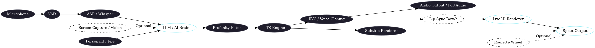

# Persona Engine

An AI-powered interactive avatar engine using Live2D, Large Language Models (LLMs), Automatic Speech Recognition (ASR), Text-to-Speech (TTS), and Real-time Voice Cloning (RVC). Designed primarily for VTubing, streaming, and virtual assistant applications.

<p align="center">

</p>

## Overview

Persona Engine brings 2D digital characters to life. It listens to user voice input, processes it using powerful AI language models, generates a response based on a defined personality, speaks the response using synthesized and potentially cloned voice, and animates a Live2D avatar accordingly. The visual output can be easily integrated into streaming software like OBS Studio via Spout.

## ✨ Features

*   **Live2D Avatar Integration:**
    *   Loads and renders Live2D models.
    *   (Potential for lip-sync and animation triggers based on audio/state - needs further verification).
*   **AI-Driven Conversation:**
    *   Connects to OpenAI-compatible LLM APIs (local or cloud) for text generation.
    *   Supports separate models/endpoints for text and vision capabilities.
    *   Uses a customizable `personality.txt` file to define the avatar's character.
*   **Voice Interaction:**
    *   Captures audio via microphone (supports NAudio and PortAudio backends).
    *   Uses Silero VAD (Voice Activity Detection) to detect speech.
    *   Transcribes speech-to-text using Whisper models (via Whisper.net, supporting different model sizes like `ggml-large-v3-turbo` and `ggml-tiny.en`).
*   **Advanced Text-to-Speech (TTS):**
    *   Sophisticated TTS pipeline including text normalization, sentence segmentation (OpenNLP), phonemization (G2P, Espeak fallback), and ONNX-based synthesis.
    *   Supports custom voice models (using `kokoro`).
    *   Configurable voice parameters (speed, sample rate, etc.).
*   **Real-time Voice Cloning (RVC):**
    *   Integrates RVC models to transform the TTS output voice in real-time.
    *   Configurable RVC parameters (voice, pitch shift, etc.).
*   **Customizable Subtitles:**
    *   Displays real-time subtitles for the avatar's speech.
    *   Highly configurable: Font, size, color, highlight, position, animation, maximum lines.
*   **Screen Awareness (Experimental/Optional):**
    *   Includes a "Vision" module capable of capturing specific application windows.
    *   Connects to a Vision LLM to potentially allow the avatar to comment on screen content (currently disabled in default config).
*   **Interactive Roulette Wheel (Experimental/Optional):**
    *   An on-screen interactive spinning wheel for games or decisions.
    *   Customizable sections, appearance, animation, and positioning (currently disabled in default config).
*   **Streaming Output (Spout):**
    *   Outputs visuals (Live2D, Roulette Wheel) via Spout, allowing direct integration into OBS Studio or other Spout-compatible software without screen capture.
    *   Supports multiple named Spout outputs with different resolutions.
*   **Audio Output:**
    *   Plays synthesized audio through the default system output device (using PortAudio).
    *   (Potential for VBAN audio streaming support - needs verification if fully implemented/enabled).
*   **Configuration:**
    *   Most features are configured via `appsettings.json`.
    *   Includes an integrated UI configuration editor for potentially easier adjustments.
*   **Profanity Detection:**
    *   Basic + ML based system for detecting and potentially filtering toxic language.

## ⚙️ Architecture / How it Works

The engine follows a general pipeline:

1.  **Input:**
    *   🎤 Microphone captures audio.
    *   🗣️ VAD detects speech segments.
    *   📝 ASR (Whisper) transcribes speech to text.
    *   (Optional) 👀 Vision module captures screen content.
2.  **Processing:**
    *   🧠 Text (and optional vision data) is sent to the LLM (using the defined personality).
    *   💬 LLM generates a text response.
    *   🤬 (Optional) Profanity check is performed.
3.  **Output:**
    *   🔊 TTS synthesizes the text response into audio.
    *   🎤 RVC transforms the synthesized voice (if enabled).
    *   🎭 Live2D avatar animates (e.g., lip-sync).
    *   📜 Subtitles are generated and displayed.
    *   🎶 Audio is played back via PortAudio.
    *   📺 Visuals (Avatar, Subtitles, Wheel) are sent via Spout.

[](imgs/diagram.png)

## 📋 Prerequisites

*   **.NET 9.0 SDK:** Required to build and run the project.
*   **GPU with CUDA Support:** Essential for efficient operation of ONNX Runtime GPU, Whisper.net CUDA, and potentially RVC. Ensure you have compatible NVIDIA drivers installed.
*   **Live2D Avatar Model:** You need to provide your own Live2D model files (place them in `Resources/Live2D/Avatars/`).
*   **TTS Resources:**
    *   TTS voice models (e.g., `kokoro` format) placed in the configured `ModelDirectory`.
    *   `espeak-ng` installed and accessible in your system's PATH if using the Espeak fallback phonemizer.
    *   Other required TTS model files (like OpenNLP models) need to be present.
*   **(Optional) RVC Models:** If using RVC, place the required RVC model files in an accessible location and configure the path.
*   **LLM Access:** An OpenAI-compatible API endpoint. This can be a local server (like llama.cpp server, Ollama with an OpenAI compatibility layer) or a cloud service. You need the **endpoint URL** and potentially an **API key**.
*   **Whisper Model:** Download the desired GGUF format Whisper model (e.g., `ggml-large-v3-turbo.bin`) and place it in `Resources/Models/`.
*   **Other ONNX Models:** Ensure required ONNX models (`silero_vad.onnx`, etc.) are present in `Resources/Models/`.

## 🚀 Installation & Setup

1.  **Clone the Repository:**
    ```bash
    git clone <repository-url>
    cd PersonaEngine
    ```
2.  **Restore Dependencies:**
    ```bash
    dotnet restore src/PersonaEngine/PersonaEngine.sln
    ```
3.  **Build the Solution:**
    ```bash
    # For Debug build
    dotnet build src/PersonaEngine/PersonaEngine.sln -c Debug

    # For Release build
    dotnet build src/PersonaEngine/PersonaEngine.sln -c Release
    ```
    *(Note: The build process should copy necessary native libraries and resources to the output directory).*
4.  **Ensure Prerequisites:** Place all required models (Live2D, Whisper, TTS, RVC, ONNX) in their respective `Resources` subdirectories within the output folder (e.g., `src/PersonaEngine/PersonaEngine.App/bin/Debug/net9.0/Resources/`).
5.  **Configure `appsettings.json`:**
    *   Open `src/PersonaEngine/PersonaEngine.App/appsettings.json`.
    *   **Crucially, update:**
        *   `Llm.TextEndpoint`, `Llm.TextModel`, `Llm.TextApiKey` (if required).
        *   `Llm.VisionEndpoint`, `Llm.VisionModel`, `Llm.VisionApiKey` (if using Vision).
        *   `Live2D.ModelName` to match your avatar's folder name.
        *   `Tts.ModelDirectory` if your TTS models are elsewhere.
        *   `Tts.EspeakPath` if `espeak-ng` is not in the default PATH.
        *   Configure `Tts.Voice` and `Tts.Rvc` as needed.
        *   Adjust `SpoutConfigs` names and resolutions if required.
        *   Review and modify other settings (Window size, Subtitles, Vision, RouletteWheel) as desired.
6.  **Run the Application:**
    ```bash
    cd src/PersonaEngine/PersonaEngine.App
    dotnet run
    ```
    *(Or run the executable directly from the build output directory, e.g., `bin/Debug/net9.0/PersonaEngine.App.exe`)*

## 🔧 Configuration (`appsettings.json`)

The `appsettings.json` file controls most aspects of the engine:

*   `Window`: Window dimensions, title, fullscreen mode.
*   `Llm`: API keys, model names, and endpoints for text and vision AI.
*   `Tts`: Paths to models, espeak, voice settings (default voice, speed, RVC options).
*   `Subtitle`: Font, size, colors, margins, animation, layout.
*   `Live2D`: Path to avatar resources, name of the model to load, render dimensions.
*   `SpoutConfigs`: Defines one or more Spout outputs (name, resolution).
*   `Vision`: Settings for screen capture (target window, enable/disable, interval).
*   `RouletteWheel`: Settings for the interactive wheel (enable/disable, appearance, animation, sections).

## ▶️ Usage

1.  Ensure all prerequisites are met and `appsettings.json` is configured correctly.
2.  Run the application.
3.  The main window should appear displaying the Live2D avatar.
4.  Speak into your configured microphone. The engine should detect your voice, transcribe it, send it to the LLM, get a response, synthesize it, play the audio, and display subtitles.
5.  If Spout outputs are configured, connect to them in your streaming software (e.g., add a Spout2 Capture source in OBS).

## 💡 Potential Use Cases

*   **VTubing & Live Streaming:** Provide an interactive AI companion/character for streams.
*   **Virtual Assistant:** A desktop character that can answer questions or perform simple tasks via voice.
*   **Interactive Kiosks/Installations:** An animated character for public engagement.
*   **Educational Tools:** An AI tutor or guide with a visual presence.
*   **Gaming:** An AI-powered NPC or companion character.

## 🙌 Contributing

Contributions are welcome! Please follow standard practices:

1.  Fork the repository.
2.  Create a new branch (`git checkout -b feature/your-feature-name`).
3.  Make your changes.
4.  Commit your changes (`git commit -m 'Add some feature'`).
5.  Push to the branch (`git push origin feature/your-feature-name`).
6.  Open a Pull Request.

Please ensure your code adheres to the project's coding style and includes tests where applicable.