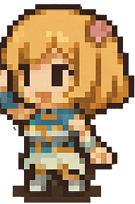
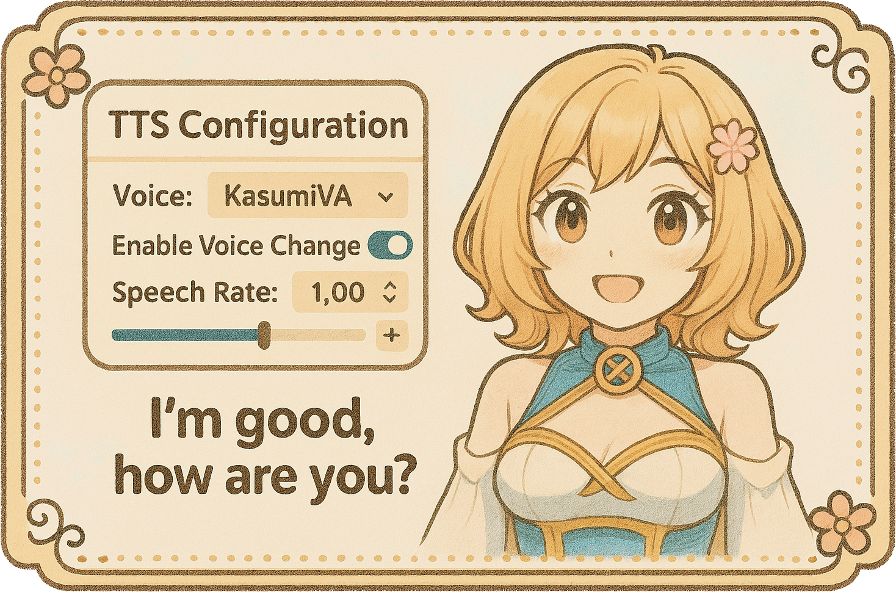
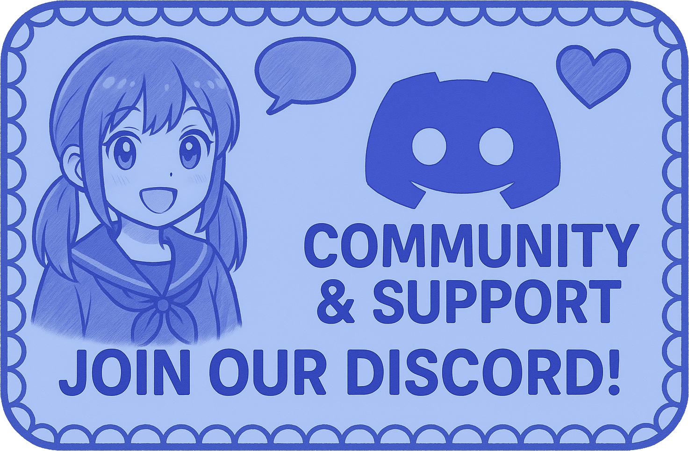
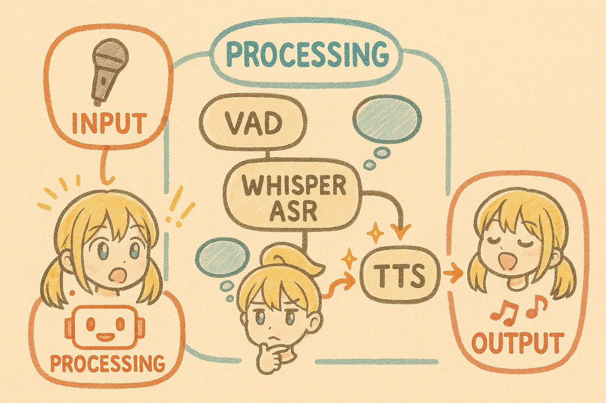

<div align="center">
<h1>
Persona Engine 
</h1>
  <a href="https://github.com/fagenorn/handcrafted-persona-engine/releases" target="_blank">

</a>
  <a href="https://discord.gg/p3CXEyFtrA" target="_blank">

</a>
<a href="https://x.com/fagenorn" target="_blank">

</a>
<p>
An AI-powered interactive avatar engine using Live2D, Large Language Models (LLMs), Automatic Speech Recognition (ASR), Text-to-Speech (TTS), and Real-time Voice Cloning (RVC). Designed primarily for VTubing, streaming, and virtual assistant applications. Let's bring your character to life! ✨
</p>


<h2>💖 See it in Action! 💖</h2>
<p>Watch Persona Engine work its magic:</p>
<a href="https://www.youtube.com/watch?v=4V2DgI7OtHE" target="_blank">
  
</a>
</div>


## <a id="toc"></a>📜 Table of Contents

*   [🌸 Overview: What's Inside?](#overview)
*   [✨ Features Galore!](#features)
*   [💬 Join Our Community!](#community)
*   [⚙️ Architecture / How it Works](#architecture)
*   [📋 Prerequisites: Let's Get Ready!](#prerequisites)
    *   [System Requirements](#prereq-system)
    *   [Installing NVIDIA CUDA and cuDNN (REQUIRED!)](#prereq-cuda)
    *   [Software to Install](#prereq-software)
    *   [Essential Models & Resources (Downloads!)](#prereq-models)
    *   [Optional: RVC Models](#prereq-rvc)
    *   [LLM Access](#prereq-llm)
    *   [Spout Receiver](#prereq-spout)
*   [🚀 Getting Started: Let's Go!](#getting-started)
    *   [Easy Install (Recommended for Windows)](#install-release)
    *   [Building from Source (Advanced)](#install-source)
*   [🔧 Configuration (`appsettings.json`)](#configuration)
*   [▶️ Usage: Showtime!](#usage)
*   [🛠️ Troubleshooting](#troubleshooting)
*   [💡 Potential Use Cases](#use-cases)
*   [🙌 Contributing](#contributing)


## <a id="overview"></a>🌸 Overview: What's Inside?

Persona Engine listens to your voice 🎤, thinks using powerful AI language models 🧠 (guided by a personality you define!), speaks back with a synthesized voice 🔊 (which can even be cloned!), and animates a cute Live2D avatar 🎭 accordingly. The visuals can easily pop into your streaming software like OBS Studio using Spout!

> **❗ Important Note on AI Model and Personality:**
> Persona Engine shines brightest with a **specially fine-tuned Large Language Model (LLM)**. This model understands the engine's unique way of sending info, leading to more natural, in-character chats!
>
> While you *can* use standard OpenAI-compatible models (like those from Ollama, Groq, OpenAI, etc.) by carefully editing the `Resources/Prompts/personality.txt` file, it might take some extra effort (prompt engineering magic!) to get perfect results.
>
> ✨ I've included a helpful template for standard models! Look for `personality_example.txt` **in the root of the source code repository** (you might need to grab it from the [GitHub repo page](https://github.com/fagenorn/handcrafted-persona-engine) if you only downloaded the release `.zip`). This file is a starting point if you're using a standard model. Copy its ideas or content into your *actual* `personality.txt` file (located in `Resources/Prompts/` inside the extracted release folder).
>
> The fine-tuned model is currently being tested. Want to try it or see a demo? Hop into our Discord! 😊


## <a id="features"></a>✨ Features Galore!
<div align="center">

</div>

*   🎭 **Live2D Avatar Integration:** Loads and renders your Live2D models. (Lip-sync/animation triggers planned!)
*   🧠 **AI-Driven Conversation:** Connects to OpenAI-compatible LLM APIs (run locally or in the cloud!), using `personality.txt`. Optimized for the special fine-tuned model (see [Overview](#overview)).
*   🗣️ **Voice Interaction:** Listens via microphone (NAudio/PortAudio), detects speech with Silero VAD, and understands you with Whisper ASR (Whisper.net). **GPU Recommended!**
*   🔊 **Advanced Text-to-Speech (TTS):** A fancy pipeline (normalization, segmentation, phonemization, ONNX synthesis) brings text to life, supporting custom `kokoro` voices. **GPU Recommended!**
*   👤 **Real-time Voice Cloning (RVC):** Integrates RVC ONNX models to make the TTS voice sound like someone specific in real-time! **GPU Required for performance!**
*   📜 **Customizable Subtitles:** Show what's being said with lots of options to make it look just right.
*   👀 **Screen Awareness (Experimental):** Optional Vision module lets the AI "see" application windows.
*   🎡 **Interactive Roulette Wheel (Experimental):** Spin a fun wheel on screen!
*   📺 **Streaming Output (Spout):** Sends the visuals directly to OBS or other Spout-compatible software. No window capture needed!
*   🎶 **Audio Output:** Plays generated speech clearly (via PortAudio).
*   ⚙️ **Configuration:** Easy setup via `appsettings.json` and a built-in UI editor.
*   🤬 **Profanity Detection:** Basic + ML-based filtering options.


<div align="center">
<br>
<h2><a id="community"></a>💬 Join Our Community! 💬</h2>
<p>
Need help getting started? Have questions or brilliant ideas? 💡 Want to see a live demo, test the special fine-tuned model, or chat directly with a Persona Engine character? Having trouble converting RVC models? Come say hi on Discord! 👋
</p>
<a href="https://discord.gg/p3CXEyFtrA" target="_blank">
</a>
  <br>

</a>
<br>
</div>


## <a id="architecture"></a>⚙️ Architecture / How it Works

It's like a little assembly line for bringing characters to life!

1.  **Input:** 🎤 Mic -> 👂 VAD (Detects Speech) -> 📝 ASR (Speech-to-Text) -> (Optional) 👀 Vision (Sees Screen).
2.  **Processing:** 🧠 LLM (Uses Personality from `personality.txt` - ideally the fine-tuned one!) -> 💬 Response -> (Optional) 🤬 Profanity Check.
3.  **Output:** 🔊 TTS (Text-to-Speech) -> 👤 RVC (Optional Voice Clone) -> 🎭 Live2D Animation -> 📜 Subtitles -> 🎶 Audio Playback -> 📺 Spout Visuals.

<div align="center">
<br/>

<br/>
<br/>
</div>


## <a id="prerequisites"></a>📋 Prerequisites: Let's Get Ready!

Before starting the magic, let's gather the supplies! Make sure you have everything below.

<div align="center">

<p>Make sure you have these ready:</p>
</div>

### <a id="prereq-system"></a>1. System Requirements 🖥️

<details>
<summary><strong>➡️ Click here for detailed system notes...</strong></summary>

*   💻 **Operating System:**
    *   ✅ **Windows (Recommended):** Developed and tested here! Pre-built releases are Windows-only.
    *   ⚠️ **Linux / macOS:** Possible *only* by building from source. Needs extra tech skills for setup (CUDA, Spout alternatives, Audio libs) and is **not officially supported**. Good luck, adventurer!
*   💪 **Graphics Card (GPU):**
    *   ✅ **NVIDIA GPU with CUDA (Required for GPU Features):** This is **essential** for acceptable performance with ASR, TTS, and especially RVC. The engine relies heavily on GPU acceleration provided by CUDA and cuDNN. See the **[CUDA & cuDNN Installation Guide](#prereq-cuda)** below. You MUST install the latest NVIDIA drivers!
    *   ⚠️ **CPU-Only / Other GPUs:** Will be **extremely slow** or potentially unstable for AI tasks. Many features may not function correctly or at usable speeds. 🐢
*   🎤 **Microphone:** To talk to your character!
*   🎧 **Speakers / Headphones:** To hear them reply!

</details>

### <a id="prereq-cuda"></a>2. 💪 Installing NVIDIA CUDA and cuDNN (For GPU Acceleration - REQUIRED!)

This step is **mandatory** if you have an NVIDIA GPU to ensure the AI components (ASR, TTS, RVC) run correctly and performantly. **Follow these steps carefully, especially for cuDNN.**

<details>
<summary><strong>➡️ Click here for the REQUIRED CUDA + cuDNN Setup Guide (Windows)...</strong></summary>

Persona Engine relies on specific CUDA components (ONNX Runtime CUDA Provider) which have strict dependencies. Failure to install these correctly will likely result in errors (see [Troubleshooting](#troubleshooting)).

1.  **Check GPU Compatibility & Install Driver:**
    *   Make sure your NVIDIA GPU supports CUDA ([NVIDIA CUDA GPUs list](https://developer.nvidia.com/cuda-gpus)).
    *   Get the **latest NVIDIA Game Ready or Studio driver** ([NVIDIA Driver Downloads](https://www.nvidia.com/Download/index.aspx)). A clean install is often best.

2.  **Install CUDA Toolkit (Version 12.1 or 12.2 Recommended):**
    *   The engine expects CUDA Runtime 12.1 or 12.2. **CUDA 12.2 is recommended**.
    *   Go to the [NVIDIA CUDA Toolkit 12.2 Download Archive](https://developer.nvidia.com/cuda-12-2-0-download-archive). (Using the archive ensures you get the correct version).
    *   Choose your system settings (Windows, x86_64, 11 or 10, `exe (local)`).
    *   Download and run the installer. **Express (Recommended)** is usually fine.
    *   Note the install path (e.g., `C:\Program Files\NVIDIA GPU Computing Toolkit\CUDA\v12.2`).

3.  **Install cuDNN Library (CRITICAL STEP - Manual Copy Required!):**
    *   cuDNN accelerates deep learning operations used by the engine.
    *   **❗ You MUST download the TARBALL (.tar.xz or .zip) version, NOT the .exe installer.** The installer often doesn't place files where ONNX Runtime expects them.
    *   Go to the [NVIDIA cuDNN Download Page](https://developer.nvidia.com/rdp/cudnn-download) (Requires a free NVIDIA Developer account).
    *   **Very Important:** Select the cuDNN version **compatible with your installed CUDA Toolkit**. For CUDA 12.2, choose a **cuDNN v8.9.x or v9.x for CUDA 12.x**. Specifically, **cuDNN v9 is recommended for CUDA 12.2**.
    *   Download the "**Local Installer for Windows (Tar)**" or "(Zip)" file for your chosen version (e.g., `cudnn-windows-x86_64-9.x.x.x_cuda12-archive.zip`).
    *   **Extract the cuDNN archive** somewhere temporary (e.g., your Downloads folder). You'll find folders like `bin`, `include`, `lib`.
    *   **Manually copy the extracted files into your CUDA Toolkit installation directory:**
        *   Copy the **contents** of the extracted cuDNN `bin` folder -> Your CUDA Toolkit `bin` folder (e.g., `C:\Program Files\NVIDIA GPU Computing Toolkit\CUDA\v12.2\bin`)
        *   Copy the **contents** of the extracted cuDNN `include` folder -> Your CUDA Toolkit `include` folder (e.g., `C:\Program Files\NVIDIA GPU Computing Toolkit\CUDA\v12.2\include`)
        *   Copy the **contents** of the extracted cuDNN `lib` folder (or `lib\x64`) -> Your CUDA Toolkit `lib\x64` folder (e.g., `C:\Program Files\NVIDIA GPU Computing Toolkit\CUDA\v12.2\lib\x64`)
        *   *(Ensure `v12.2` matches your installed CUDA version!)*

4.  **Add CUDA Binaries to System Path (Important!):**
    *   Helps Windows and the application find the necessary CUDA libraries.
    *   Search "Environment Variables" in Windows -> Click "Edit the system environment variables".
    *   Click the "Environment Variables..." button.
    *   Under "System variables", find the `Path` variable -> Click "Edit...".
    *   Click "New" and add the path to your CUDA `bin` directory (use your actual CUDA version):
        *   `C:\Program Files\NVIDIA GPU Computing Toolkit\CUDA\v12.2\bin`
    *   *(Optional but sometimes helpful: Add `libnvvp` path too)*
        *   `C:\Program Files\NVIDIA GPU Computing Toolkit\CUDA\v12.2\libnvvp`
    *   Click OK on all windows to save the changes.

5.  **Restart Your Computer!**
    *   This is **crucial** for the system PATH changes and driver/library updates to take full effect.

6.  **Verification (Optional but Recommended):**
    *   After restarting, open Command Prompt (`cmd`).
    *   Type `nvidia-smi` and press Enter. If it runs and shows your GPU details along with the CUDA version you installed (e.g., CUDA Version: 12.2), the driver and basic CUDA setup are likely correct.
    *   When you run Persona Engine, check its console window for messages indicating that CUDA is detected and initialized successfully (e.g., messages from ONNX Runtime). If you see errors mentioning `cudnn64_*.dll` or `onnxruntime_providers_cuda.dll`, double-check the cuDNN manual copy (Step 3) and PATH variable (Step 4). See [Troubleshooting](#troubleshooting).

</details>

### <a id="prereq-software"></a>3. 🛠️ Software to Install (Besides CUDA/Drivers)

You need these two helpers installed *before* running Persona Engine:

*   ✅ **[.NET 9.0 Runtime](https://dotnet.microsoft.com/download/dotnet/9.0):** The engine's core framework. Install the **Runtime** (not SDK unless building from source) system-wide from Microsoft. (The release `.zip` *might* include a `dotnet_runtime` folder for convenience, but a system-wide install is preferred).
*   ✅ **[`espeak-ng`](https://github.com/espeak-ng/espeak-ng/releases):** Required by the TTS system for phonemization (pronouncing words correctly). **TTS will likely fail without it!**
    1.  Go to the `espeak-ng` releases page.
    2.  Download the latest installer for Windows (e.g., `espeak-ng-*.msi`).
    3.  ❗ **Important:** During installation, **make sure to check the box that says "Add espeak-ng to the system PATH"**. This is the easiest way.
    4.  *Alternatively*: If you don't add it to PATH during install, you **must** manually find the `espeak-ng.dll` file (usually in `C:\Program Files\eSpeak NG`) and put its *full path* into the `Tts.EspeakPath` setting in `appsettings.json`.

### <a id="prereq-models"></a>4. ❗ Essential Models & Resources (Download Separately!) ❗

The releases `.zip` includes most core components (TTS models, VAD, demo avatar, personality template). However, the large Whisper ASR models need to be downloaded manually, and the `personality_example.txt` file needs to be obtained from the source repository if using a standard LLM.

*   🧠 **Whisper ASR Models (Mandatory Download):**
    *   **What:** AI models that convert your voice 🗣️ into text 📝. **GGUF format is required.**
    *   You need **both**:
        *   `ggml-tiny.en.bin` (Faster, lower quality, good for initial tests)
        *   `ggml-large-v3-turbo.bin` (Slower, higher accuracy, recommended for actual use!)
    *   **Where to get them:** Download both `.bin` files from the dedicated release tag:
        **[➡️ Download Whisper Models Here ⬅️](https://github.com/fagenorn/handcrafted-persona-engine/releases/tag/whisper_models)**
    *   **Where they go:** After unzipping Persona Engine, place **both** downloaded `.bin` files directly into the 📁 `Resources/Models/` folder.

*   🎭 **Your Live2D Avatar Model (Demo Included / Replaceable):**
    *   **What:** Your character's data files (`.model3.json`, textures, physics, motions, etc.).
    *   **Included:** A demo avatar ("Haru") is provided in 📁 `Resources/Live2D/Avatars/Haru/`. The default configuration (`appsettings.json`) points to this model.
    *   **To use yours:** Create a new folder inside 📁 `Resources/Live2D/Avatars/` (e.g., `MyAvatar`), place all your Live2D model files inside that folder. Then, edit `appsettings.json` and change the `Live2D.ModelName` setting to match your folder name (e.g., `"MyAvatar"`).

*   📝 **Personality Prompts (`personality.txt` & `personality_example.txt`):**
    *   **What:** Text files that instruct the LLM on how your character should behave, speak, and react. 🧠✨ Critical for defining the persona.
    *   **`personality.txt`:** This is the **active** configuration file loaded by the engine, located in `Resources/Prompts/` within the extracted application folder. It's initially optimized for the special fine-tuned model (see [Overview](#overview)).
    *   **`personality_example.txt`:** This is a **template and guide** specifically designed for use with **standard** OpenAI-compatible LLMs (like those from Ollama, Groq, standard OpenAI models). **It is located in the root of the source code repository**, not in the release `.zip`. You must get it from [GitHub](https://github.com/fagenorn/handcrafted-persona-engine).
    *   ❗ **Action Required if using a Standard LLM:** The default `personality.txt` (included in the release `.zip`) likely **won't work well** out-of-the-box with standard models. You **must**:
        1.  Obtain `personality_example.txt` from the [source code repository](https://github.com/fagenorn/handcrafted-persona-engine/blob/main/personality_example.txt).
        2.  Open the `personality.txt` file located in `Resources/Prompts/` inside your Persona Engine folder.
        3.  **Delete the default contents of `personality.txt`.**
        4.  **Copy the entire contents from `personality_example.txt` into the now empty `personality.txt`**.
        5.  Afterwards, customize the instructions within `personality.txt` extensively to define your specific character. This requires prompt engineering effort!
    *   **Where it is:** The *active* `personality.txt` is in the 📁 `Resources/Prompts/` folder. The *example template* `personality_example.txt` is in the [repository root](https://github.com/fagenorn/handcrafted-persona-engine).

*   🔊 **TTS Resources (Included in Release):** Files needed for speech synthesis (voices, phonemizers, etc.). Found in 📁 `Resources/Models/kokoro/`. Typically no user action needed here.
*   👂 **VAD Model (Included in Release):** The Voice Activity Detection model (`silero_vad.onnx`). Found in 📁 `Resources/Models/`.

### <a id="prereq-rvc"></a>5. Optional: 👤 RVC Models (for Voice Cloning)

*   **What:** If you want the synthesized TTS voice to mimic a specific target voice, you need a Real-time Voice Cloning (RVC) model trained for that voice. The model **must be exported to ONNX format** (usually a single `.onnx` file).
*   **Note on `.pth` files:** Standard RVC training outputs `.pth` files. These **cannot be used directly** and **must be converted to the ONNX format**. This conversion process can be complex. Need assistance? Join our Discord! 😊
*   **Where it goes:** Place your converted RVC `.onnx` file inside the 📁 `Resources/Models/rvc/voice/` folder. You'll also need to enable RVC in `appsettings.json`.

### <a id="prereq-llm"></a>6. 🧠 LLM Access (The "Brain")

*   **What:** You need connectivity to a Large Language Model service via an OpenAI-compatible API. This involves knowing:
    *   **API Endpoint URL:** The web address where the LLM service is hosted (e.g., `http://localhost:11434/v1` for a local Ollama instance routed through LiteLLM, or a cloud provider's URL like `https://api.openai.com/v1`).
    *   **(Optional) API Key:** A secret token required by some services (e.g., OpenAI, Groq). Leave blank if not needed.
    *   **Model Name:** The identifier of the specific AI model you want to use (e.g., `gpt-4o`, `llama3`, `mistral`, `your-fine-tuned-model-id`).
*   **Options:**
    *   **🏠 Local:** Run an LLM on your own computer using tools like Ollama, LM Studio, Jan, etc. Often requires a proxy like LiteLLM to provide the OpenAI-compatible `/v1` endpoint. Needs a powerful PC, especially significant GPU VRAM (Video Memory)!
    *   **☁️ Cloud:** Use a hosted LLM service (OpenAI, Groq, Anthropic, Together AI, etc.). Usually requires account creation, API key generation, and may incur costs based on usage.
*   ❗ **Personality Reminder:** Remember to configure `Resources/Prompts/personality.txt` appropriately for the type of LLM you are connecting to (use `personality_example.txt` from the repo as a guide for standard models). Join the Discord for details on accessing the recommended fine-tuned model.

### <a id="prereq-spout"></a>7. 📺 Spout Receiver (To See Your Avatar!)

*   **What:** Persona Engine **does not display the avatar in its own main window**. It renders the avatar and sends the video feed out using a technology called **Spout**. You need a separate application capable of receiving a Spout stream to view the output.
*   **Recommendation:** ✅ **OBS Studio** is the most common and highly recommended application for this, especially if you plan on streaming or recording.
*   **Required Plugin for OBS:** You must install the **Spout2 Plugin for OBS Studio**. Download it from: [https://github.com/Off-World-Live/obs-spout2-plugin/releases](https://github.com/Off-World-Live/obs-spout2-plugin/releases) (Make sure to download the correct version for your OBS installation).
*   **How:** Install the Spout2 plugin into your OBS Studio installation directory. After starting Persona Engine, you will add a "Spout2 Capture" source in OBS to receive the video feed (details in [Getting Started](#getting-started)).


## <a id="getting-started"></a>🚀 Getting Started: Let's Go!
<div align="center">

<p>Ready to bring your character to life? Choose your path:</p>
</div>

### <a id="install-release"></a>Method 1: Easy Install with Pre-built Release (Recommended for Windows Users 💖)

This is the simplest way to get up and running on Windows.

**Step 1: 💾 Download & Extract Persona Engine**

<div align="center">
  <a href="https://github.com/fagenorn/handcrafted-persona-engine/releases/latest" target="_blank">
  
  </a>
  <p><i>(Click the button, get the `.zip` file from the latest release!)</i></p>
</div>

*   Locate the downloaded `.zip` archive (e.g., `PersonaEngine_vX.Y.Z.zip`).
*   Right-click the file and choose "Extract All..." (or use a tool like 7-Zip or WinRAR).
*   Select a location to extract the files. ✅ **Recommended:** A simple path like `C:\PersonaEngine` or on another drive. **Avoid** system-protected folders like `C:\Program Files` or `C:\Windows`.

**Step 2: 🛠️ Install Prerequisites (CRITICAL - Do not skip!)**

*   ✅ **NVIDIA Driver, CUDA, and cuDNN:** Essential for GPU features. Did you install them correctly following the **REQUIRED** guide? (See [Prerequisites Section 2](#prereq-cuda), paying close attention to the manual cuDNN copy). **Reboot** after installation!
*   ✅ **.NET 9.0 Runtime:** Is the runtime installed system-wide? (See [Prerequisites Section 3](#prereq-software)).
*   ✅ **`espeak-ng`:** Is it installed, and crucially, was it **added to the system PATH** during installation? (See [Prerequisites Section 3](#prereq-software)). If not added to PATH, you'll need to edit `appsettings.json` later.

**Step 3: 📥 Download and Place Required Whisper Models**

*   Go to the Whisper Models download page: **[➡️ Download Here ⬅️](https://github.com/fagenorn/handcrafted-persona-engine/releases/tag/whisper_models)**
*   Download **both** `.bin` files: `ggml-tiny.en.bin` and `ggml-large-v3-turbo.bin`.
*   Navigate into the folder where you extracted Persona Engine. Find the 📁 `Resources/Models/` subfolder.
*   Place the two downloaded `.bin` files directly inside this `Resources/Models/` folder.

**Step 4: ⚙️ Initial Configuration (`appsettings.json` & `personality.txt`)**

*   In your extracted Persona Engine folder, find the `appsettings.json` file. Open it with a good text editor (like Notepad++, VS Code, Sublime Text, or even standard Notepad).
*   **Primary Settings to Verify/Edit:**
    *   `Llm` section:
        *   `TextEndpoint`: Set this to the full URL of your LLM API service (e.g., `http://localhost:11434/v1`, `https://api.openai.com/v1`).
        *   `TextModel`: Enter the exact name of the LLM model you intend to use (e.g., `llama3`, `gpt-4o`, `your-finetuned-model`).
        *   `TextApiKey`: Enter your API key *only if* your LLM service requires one. Otherwise, leave it as `""` (empty string).
    *   `Live2D` section:
        *   `ModelName`: By default, this is likely `"Haru"`. If you plan to use the included demo model initially, leave it. If you've already placed your own Live2D model in `Resources/Live2D/Avatars/YourModelFolder/`, change this value to `"YourModelFolder"`.
    *   `(If needed) Tts.EspeakPath`: If you did **not** add `espeak-ng` to your system PATH during installation, find the `espeak-ng.dll` file (e.g., `C:\Program Files\eSpeak NG\espeak-ng.dll`) and put that full path here. Otherwise, leave it as `""`.
*   Save the changes to `appsettings.json`.
*   **Configure Personality (`personality.txt`) - IMPORTANT!**
    *   Navigate to the 📁 `Resources/Prompts/` folder inside your Persona Engine installation directory.
    *   ❗ **Reminder:** If you are **not** using the special fine-tuned LLM (ask on Discord!), the default `personality.txt` content (included in the `.zip`) is likely unsuitable for standard models.
    *   **Action:**
        1.  Go to the [Persona Engine GitHub repository](https://github.com/fagenorn/handcrafted-persona-engine).
        2.  Find and open the `personality_example.txt` file in the main (root) directory.
        3.  Copy its entire contents.
        4.  Open the `personality.txt` file located in your `Resources/Prompts/` folder.
        5.  **Delete all the default content** inside `personality.txt`.
        6.  **Paste the content you copied from `personality_example.txt`** into the now empty `personality.txt`.
        7.  Now, **edit `personality.txt`** thoroughly. Modify the instructions, rules, character descriptions, example dialogues, etc., to match the specific persona you want to create. This is a crucial step and may require experimentation (prompt engineering).
    *   Save `personality.txt`.

**Step 5: ▶️ Run Persona Engine!**

*   Find and double-click the `PersonaEngine.exe` file in the main extracted folder.
*   A **Configuration and Control UI** window should appear. This window is for settings and monitoring; **it does not show the avatar**.
*   A separate **console window** (black background with text) will likely open behind the UI. **Watch this console window** for startup messages, especially look for confirmation that CUDA/GPU is detected and initialized correctly. Note any errors.
*   If the LLM connection is successful and the required models are found, the engine should initialize and start listening for your voice. Try speaking into your microphone! 🎤

**Step 6: 📺 View the Avatar (via Spout in OBS)**

*   You need a Spout receiver application running. This guide uses OBS Studio.
*   ✅ Ensure **OBS Studio** is installed.
*   ✅ Ensure the **Spout2 Plugin for OBS** is installed correctly (link in [Prerequisites Section 7](#prereq-spout)).
*   Launch OBS Studio.
*   In the "Sources" panel (usually at the bottom), click the "+" button.
*   Select **"Spout2 Capture"** from the list.
*   Give the source a name (e.g., "Persona Engine Avatar") and click OK.
*   A properties window will appear. Look for the "Spout Sender" dropdown list.
*   Select the sender corresponding to Persona Engine (it should appear automatically if the engine is running, e.g., "PersonaEngineOutput").
*   Click OK. Your Live2D avatar, rendered by Persona Engine, should now appear in your OBS scene! ✨ Resize and position as needed.

**Step 7: 🔧 Further Customization (Optional)**

*   Explore other settings in `appsettings.json` (like audio input/output devices, TTS voice selection, speed/pitch, subtitle appearance, RVC model enabling) or adjust some settings live using the **Configuration and Control UI**.

---

### <a id="install-source"></a>Method 2: Building from Source (For Developers & Advanced Users 🛠️)

*(This requires more technical steps and familiarity with .NET development.)*

1.  **Prerequisites:**
    *   ✅ Install **Git**.
    *   ✅ Install **.NET 9.0 SDK** (Software Development Kit) ([Microsoft](https://dotnet.microsoft.com/download/dotnet/9.0)).
    *   ✅ Install **`espeak-ng`** (+ added to system PATH). (See [Prerequisites Section 3](#prereq-software)).
    *   ✅ Install **NVIDIA Driver, CUDA, and cuDNN** following the **REQUIRED** guide meticulously (manual cuDNN copy!). (See [Prerequisites Section 2](#prereq-cuda)). **Reboot** after install.
    *   ⚠️ Non-Windows: Requires finding and installing equivalents for PortAudio, Spout (like Syphon on macOS), and handling platform-specific dependencies. **This is unsupported territory!**
2.  **Clone Repository:**
    ```bash
    git clone https://github.com/fagenorn/handcrafted-persona-engine.git
    cd handcrafted-persona-engine
    ```
3.  **Restore Dependencies:** Open a terminal or command prompt in the repository root directory and run:
    ```bash
    dotnet restore
    ```
4.  **Build the Application:**
    ```bash
    # Example command for a Release build for Windows x64:
    dotnet publish PersonaEngine.App -c Release -r win-x64 -o ./publish --self-contained false
    # Adjust -r (runtime identifier) if needed, e.g., linux-x64, osx-x64 (unsupported)
    # --self-contained false relies on the globally installed .NET Runtime
    ```
5.  **Navigate to Output Directory:** The built application files will be in the `./publish` folder (or wherever your `-o` argument pointed).
6.  **Prepare Models & Resources Directory:**
    *   Go into the `./publish` directory.
    *   Manually create the necessary folder structure if it doesn't exist: 📁 `Resources/Models/rvc/voice`, 📁 `Resources/Live2D/Avatars`, 📁 `Resources/Prompts`.
    *   📥 **Download Whisper GGUF models:** Get `ggml-tiny.en.bin` and `ggml-large-v3-turbo.bin` from the [Whisper Models Release](https://github.com/fagenorn/handcrafted-persona-engine/releases/tag/whisper_models) and place them into `./publish/Resources/Models/`.
    *   🎭 **Place Live2D Model:** Put your Live2D model files into a new subfolder within `./publish/Resources/Live2D/Avatars/` (e.g., `./publish/Resources/Live2D/Avatars/MyModel/`).
    *   🔊 **Copy Core Models:** Copy the contents of the *original repository's* `Resources/Models` folder (including the `kokoro` subfolder and `silero_vad.onnx`) into your `./publish/Resources/Models/` folder.
    *   📝 **Copy Prompts:** Copy `personality.txt` and `personality_example.txt` from the *original repository's* `Resources/Prompts` folder into your `./publish/Resources/Prompts/` folder. **Important:** You will likely need to edit the copied `personality.txt` based on `personality_example.txt` if using a standard LLM (see step 7).
    *   👤 **Place RVC Models (Optional):** If using RVC, place your `.onnx` RVC model file(s) into `./publish/Resources/Models/rvc/voice/`.
7.  **Configure `appsettings.json` & `personality.txt`:**
    *   Copy the `appsettings.json` file from the source project (`PersonaEngine.App/appsettings.json`) into your `./publish` directory.
    *   ⚙️ Edit `./publish/appsettings.json`: Configure `Llm` settings (Endpoint, Model, Key), set `Live2D.ModelName` to your model's folder name, and adjust `Tts.EspeakPath` if needed (as described in Method 1, Step 4).
    *   ❗ **Critically:** Edit `./publish/Resources/Prompts/personality.txt`. **If using a standard LLM, you MUST replace its content with the content from `personality_example.txt` (also copied in step 6)** and then customize it extensively for your character and LLM.
8.  **Run the Application:**
    *   Open a terminal or command prompt inside the `./publish` directory.
    *   ▶️ Execute the application: `dotnet PersonaEngine.App.dll`
    *   Monitor the console output for initialization messages (especially CUDA status) and any errors.
    *   📺 Set up your Spout receiver (e.g., OBS) to view the avatar output as described in Method 1, Step 6.


## <a id="configuration"></a>🔧 Configuration (`appsettings.json`)

<div align="center">

<p>Configuring your engine!</p>
</div>

This JSON file, located in the main application folder (or `./publish` if built from source), is your primary control panel. Open it with a text editor. Changes typically require restarting the application unless adjustable via the UI.

*   🖼️ `Window`: Basic window settings (size, title, fullscreen options - mostly relevant if a direct view mode is added later).
*   🧠 `Llm`: **Crucial!** API Endpoint URL (`TextEndpoint`), API Key (`TextApiKey`), Model Name (`TextModel`). Also includes settings for the experimental Vision module (`VisionEndpoint`, etc.). (❗ Remember `personality.txt` setup is vital and depends on your LLM choice! Use `personality_example.txt` from the repo as a guide for standard models).
*   🎤 `AudioInput`: Select microphone device (`DeviceName`, or by `DeviceIndex`), set volume/gain.
*   👂 `Vad`: Voice Activity Detection settings (thresholds, silence duration).
*   📝 `Asr`: Whisper model settings (`ModelPath`, `GpuLayerCount` - set to high number like 99 for max GPU usage).
*   🔊 `Tts`: Text-to-Speech settings.
    *   `ModelBasePath`: Path to TTS models (usually `Resources/Models/kokoro`).
    *   `Voice`: Select the TTS voice model (e.g., "demo_kokoro").
    *   `EspeakPath`: **Set this only if `espeak-ng.dll` is NOT in your system PATH.**
    *   `Speed`, `Pitch`, `Volume`: Adjust voice characteristics.
    *   `GpuLayerCount`: Set high (e.g., 99) for GPU acceleration.
    *   `UseRvc`: Set to `true` to enable Real-time Voice Cloning.
    *   `RvcModelPath`: Path to your RVC `.onnx` model file (inside `Resources/Models/rvc/voice/`).
    *   `RvcIndexRatio`, `RvcProtectVoiceless`: RVC tuning parameters.
*   🎶 `AudioOutput`: Select speaker/headphone device (`DeviceName` or `DeviceIndex`).
*   📜 `Subtitle`: Customize subtitle appearance - font (`FontName`, `FontSize`), colors (`TextColor`, `OutlineColor`), position (`HorizontalAlignment`, `VerticalAlignment`, `MarginY`), background (`BackgroundColor`), animation effects (`FadeInSeconds`, `FadeOutSeconds`).
*   🎭 `Live2D`:
    *   `ModelsBasePath`: Path to the folder containing avatar subfolders (usually `Resources/Live2D/Avatars`).
    *   `ModelName`: **Must match the name of your avatar's subfolder** (e.g., "Haru", "MyModel").
*   📺 `SpoutConfigs`: Configure the Spout video output stream (`SenderName`, `Width`, `Height`).
*   👀 `Vision`: Settings for the experimental screen awareness feature.
*   🎡 `RouletteWheel`: Settings for the experimental interactive roulette wheel.
*   🤬 `ProfanityFilter`: Enable/disable (`IsEnabled`) and choose filter type (`FilterType`: `None`, `Simple`, `Onnx`).


## <a id="usage"></a>▶️ Usage: Showtime!

1.  ✅ **Double-check Prerequisites**: Are NVIDIA drivers, CUDA, and **cuDNN** installed correctly (using the **manual tarball copy method** as per [Section 2](#prereq-cuda))? Is .NET Runtime installed? Is `espeak-ng` installed (+ in PATH or path set in JSON)? Are the **Whisper `.bin` models** in `Resources/Models/`? Is your Spout receiver (OBS + Plugin) ready?
2.  ⚙️ **Verify Configuration**: Did you set the correct LLM `TextEndpoint`, `TextModel`, and `TextApiKey` in `appsettings.json`? Is `Live2D.ModelName` set to your avatar's folder name?
3.  📝 **Check Personality**: Is `Resources/Prompts/personality.txt` configured appropriately for your **chosen LLM**? (Did you copy from `personality_example.txt` in the repo and customize if using a standard model?)
4.  ▶️ **Run the Application**: Execute `PersonaEngine.exe` (from release) or `dotnet PersonaEngine.App.dll` (if built from source).
5.  🖥️ **Monitor Startup**: The **Config & Control UI** will appear (remember, no avatar here!). Pay close attention to the **console window** behind it for log messages, especially confirming CUDA/GPU initialization without errors.
6.  📺 **Activate Spout Receiver**: Open OBS (or your chosen receiver), add a "Spout2 Capture" source, and select the Persona Engine sender (e.g., "PersonaEngineOutput"). The avatar should appear.
7.  🎤 **Interact**: Start talking! The expected flow is:
    *   👂 VAD detects speech.
    *   📝 Whisper transcribes speech to text (check console).
    *   🧠 Text (plus context) sent to LLM.
    *   💬 LLM generates a response.
    *   🔊 TTS synthesizes the response audio (potentially with RVC).
    *   🎶 Synthesized audio plays through your speakers/headphones.
    *   📜 Subtitles appear on the Spout output feed.
    *   🎭 Live2D avatar animates (lip sync planned, basic reactions may occur).
8.  ⚙️ **Adjust Live**: Use the **Config & Control UI** to monitor performance, change input/output devices, toggle features, or tweak some settings without restarting.


## <a id="troubleshooting"></a>🛠️ Troubleshooting

<div align="center">

<p>Having trouble? Here are some common issues and solutions:</p>
</div>

*   **Error: `LoadLibrary failed with error 126: The specified module could not be found` (often mentioning `onnxruntime_providers_cuda.dll` or `cudnn64_*.dll`)**
    *   **Cause:** This almost always indicates an incorrect **cuDNN installation**. ONNX Runtime cannot find the required cuDNN libraries.
    *   **Solution:** You likely did not follow the specific **manual installation steps for cuDNN using the tarball/zip archive**. The standard NVIDIA `.exe` installer for cuDNN often fails for this use case.
        1.  Go back to the **[REQUIRED CUDA + cuDNN Setup Guide](#prereq-cuda)**.
        2.  **Carefully re-do Step 3 (Install cuDNN Library)**. Ensure you downloaded the **TAR or ZIP** version of cuDNN compatible with your CUDA 12.x installation.
        3.  **Manually copy** the files from the extracted cuDNN `bin`, `include`, and `lib` folders into the corresponding folders within your CUDA Toolkit installation directory (e.g., `C:\Program Files\NVIDIA GPU Computing Toolkit\CUDA\v12.2\`).
        4.  Ensure the CUDA `bin` directory (e.g., `...\CUDA\v12.2\bin`) is correctly listed in your **System Environment Variables `Path`** (Step 4).
        5.  **Restart your computer** (Step 5).
        6.  Run Persona Engine again and check the console logs.

*   **Text-to-Speech (TTS) is Silent or Crashes the App**
    *   **Cause 1:** `espeak-ng` is not installed or not accessible.
    *   **Solution 1:** Install `espeak-ng` (see [Prerequisites Section 3](#prereq-software)). **During installation, ensure you check the box to "Add espeak-ng to the system PATH"**. If you missed this, either reinstall `espeak-ng` and check the box, OR find `espeak-ng.dll` (usually in `C:\Program Files\eSpeak NG`) and put its full path into the `Tts.EspeakPath` setting in `appsettings.json`.
    *   **Cause 2:** TTS models are missing or corrupted.
    *   **Solution 2:** Ensure the `Resources/Models/kokoro` folder exists and contains the necessary TTS model files (usually included in the release `.zip`). If building from source, ensure you copied these correctly.

*   **App Crashes on Startup or When Speaking (Whisper/ASR Issue)**
    *   **Cause:** The required Whisper ASR models (`.bin` files) are missing or in the wrong location.
    *   **Solution:** Confirm you downloaded **both** `ggml-tiny.en.bin` AND `ggml-large-v3-turbo.bin` from the [Whisper Models Release](https://github.com/fagenorn/handcrafted-persona-engine/releases/tag/whisper_models). Make sure these two files are placed **directly** inside the `Resources/Models/` folder (not in a subfolder).

*   **No Response from LLM / LLM Errors in Console**
    *   **Cause 1:** Incorrect LLM configuration in `appsettings.json`.
    *   **Solution 1:** Double-check the `Llm.TextEndpoint` URL. Is it correct and reachable from your computer? (Try pinging the host or accessing the base URL in a browser if possible). Is the `Llm.TextModel` name exactly right for your service? If your service requires an API key, is `Llm.TextApiKey` set correctly?
    *   **Cause 2:** The LLM service itself is down or having issues.
    *   **Solution 2:** Check the status of your LLM provider (if cloud-based) or ensure your local LLM server (Ollama, etc.) is running correctly and accessible at the specified endpoint.
    *   **Cause 3:** Badly formatted `personality.txt` for the connected LLM.
    *   **Solution 3:** If using a standard LLM, ensure `personality.txt` was structured based on `personality_example.txt` (obtained from the repo). Some LLMs are very sensitive to prompt formatting. Simplify the prompt to test basic connectivity. Check the console for specific error messages returned *from* the LLM API.

*   **Avatar Not Appearing in OBS / Spout Receiver**
    *   **Cause 1:** Persona Engine is not running or failed to initialize Spout.
    *   **Solution 1:** Ensure `PersonaEngine.exe` is running and check the console logs for any Spout-related errors during startup.
    *   **Cause 2:** Spout2 Plugin for OBS is not installed or not loaded correctly.
    *   **Solution 2:** Re-download and reinstall the [Spout2 Plugin for OBS](https://github.com/Off-World-Live/obs-spout2-plugin/releases) suitable for your OBS version. Restart OBS.
    *   **Cause 3:** Incorrect Spout source configuration in OBS.
    *   **Solution 3:** In OBS, remove the existing "Spout2 Capture" source. Add a new one. In its properties, click the "Spout Sender" dropdown. Does the Persona Engine sender name (e.g., "PersonaEngineOutput") appear? If yes, select it. If not, there's likely an issue with Spout initialization in Persona Engine or the OBS plugin.
    *   **Cause 4:** Firewall blocking Spout communication (less common locally).
    *   **Solution 4:** Temporarily disable your firewall to test if this is the cause. If it works, create specific firewall rules to allow OBS and Persona Engine communication.

### Still Stuck?


*   Check the **console window** for detailed error messages - these are often key!
*   Join our [**Discord Community**](#community)! Ask for help in the support channels, providing details about:
    *   What you were trying to do.
    *   What happened (and any specific error messages from the console).
    *   Your operating system (Windows version).
    *   Your GPU model.
    *   Which LLM you are trying to connect to.


## <a id="use-cases"></a>💡 Potential Use Cases: Imagine the Fun!

<div align="center">

</div>

*   🎬 **VTubing & Live Streaming:** An AI co-host, interactive character reacting to chat/events, or fully AI-driven VTuber.
*   🤖 **Virtual Assistant:** A personalized, animated desktop companion for tasks or information.
*   🏪 **Interactive Kiosks:** An engaging, talking guide for museums, trade shows, retail environments, or information booths.
*   🎓 **Educational Tools:** An AI language practice partner, a historical figure Q&A bot, or an interactive tutor with a face.
*   🎮 **Gaming:** Creating more dynamic and conversational NPCs, companions, or even AI opponents in games.
*   💬 **Character Chatbots:** A more immersive way to interact with fictional characters online.


## <a id="contributing"></a>🙌 Contributing

Contributions are welcome! If you have improvements, bug fixes, or new features in mind:

1.  Fork the repository.
2.  Create a new feature branch (`git checkout -b feature/YourAmazingFeature`).
3.  Make your changes and commit them (`git commit -m 'Add some AmazingFeature'`).
4.  Push your branch to your fork (`git push origin feature/YourAmazingFeature`).
5.  Open a Pull Request back to the main repository.

Please try to adhere to the existing coding style and conventions. For major changes or new feature ideas, it's often best to discuss them first by opening an Issue on GitHub or chatting on the Discord server. Your help is appreciated! 😊